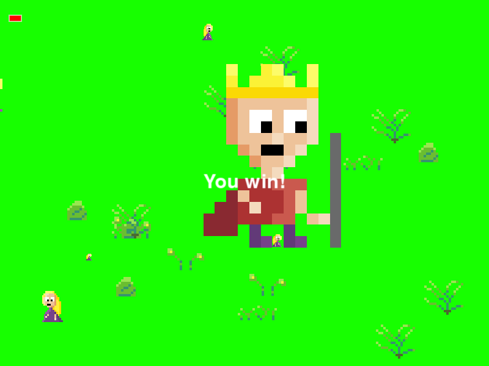

# LÖVE King eats queens
Simple a game written in Love2D game framework. The example is largely based on this example(https://inventwithpython.com/squirrel.py).

## Screenshot

## Addons
* [Love2D](https://love2d.org) - website of LÖVE.
* [Making Games with Python & Pygame](https://inventwithpython.com/pygame/) - great Pygame examples and a source of knowledge.
* [Gameplay](https://youtu.be/UiMxCe71BbU)- youtube
* [BG Music](https://opengameart.org/content/8-bit-jester-battle) - opengameart
* [Hit SFX](https://opengameart.org/content/37-hitspunches)   [LevelUp](https://opengameart.org/content/level-up-power-up-coin-get-13-sounds) - opengameart
